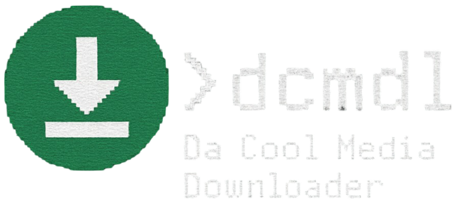

  
>
     

> *the best multimedia downloader for all websites*

# dcmdl 🤯 <sub>idk why im here 🤯🤯🤯</sub>

## 🌟 why so special? 

- custom spotify and twitter (in development) downloader (absolute pain to build)
- easy access to all your favorite downloaders
- no-hassle install

## ℹ️ wtf is this 🥀

A paragraph explaining your work, who you are, and why you made it.

### ✍️ who tf wrote ts 🥀

Mention who you are and link to your GitHub or organization's website.

## 🚀 usage 

TBD

## ⬇️ install dis shit

### u need:

- a stable os (linux 6.X, macos 13+, windows 8+, android 8+)
- python (for pip build)
- a pc/phone (duh)

### install table

|OS|Link|
|-|-|
|win x64|[link](https://example.com)|
|win arm64|[link](https://example.com)|
|macos universal|[link](https://example.com)|
|linux x64|[link](https://example.com)|
|linux arm64 (+ phones)|[link](https://example.com)|

```bash
pip install dcmdl
```

## 💭 yap abt issues and dcmdl

Add a link to the Discussions tab in your repo and invite users to open issues for bugs/feature requests.
